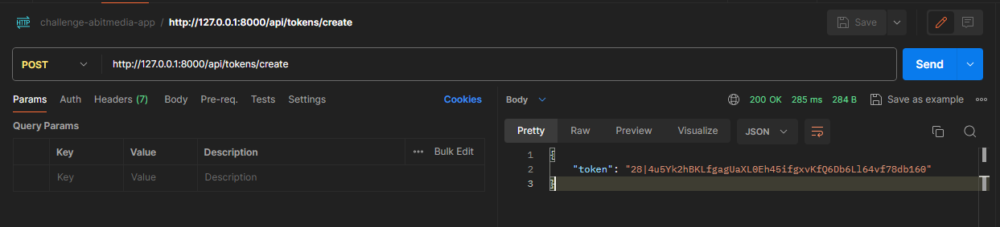

# Prueba técnica challenge-abitmedia-app
* Realizado en laravel 11.0, PHP 8.2 y MySQL

## Objetivo

Gestionar oferta de productos mediante la implementación de una API REST en PHP con persistencia de datos con operaciones CRUD.

## Requisitos

* Tener instalado Xampp (en caso de S.O. Windows) para usar BD MySql
* Tener instalado Composer (Descargar https://getcomposer.org/Composer-Setup.exe)
* Tener instalado Laravel en la versión >= 11.x (Una vez instalado Composer se puede ejecutar el comando `composer global require laravel/installer`)

## Instalación
* Clonar el proyecto del repositorio https://github.com/HenryGye/challenge-abitmedia-app.git

* Crear la base de datos `challenge_abitmedia_app`

* Instalar dependencias del proyecto
  - `composer install`
  - `npm install`

* Crear archivo .env y configurar la BD (configuración por defecto generado al crear el proyecto Laravel)

    ```
    DB_CONNECTION=mysql
    DB_HOST=127.0.0.1
    DB_PORT=3306
    DB_DATABASE=challenge_abitmedia_app
    DB_USERNAME=root
    DB_PASSWORD=
    ```

* Generar key
  - `php artisan key:generate`

* Ejecutar migraciones
  - `php artisan migrate`

* Ejecutar seeder
  - `php artisan db:seed`

* Ejecutar proyecto
  - `php artisan serve` (Por defecto se ejecutará en http://127.0.0.1:8000)

## Endpoints del proyecto

- Apis creación/eliminación de token (no requiere enviar parámetros en header ni autorización)

  - [POST] Generar token para protección de apis, usar el token devuelto como Bearer Token para autorización en cada una de las apis se softwares y servicio

    `http://127.0.0.1:8000/api/tokens/create`
  
  - [POST] Eliminar tokens generados (en este punto si se consultar algún api de softwares o servicio devolverá 'UNAUTHORIZED', se deberá volver a generar nuevo token)

    `http://127.0.0.1:8000/api/tokens/delete`

- Apis de Softwares y Servicios (Requiere enviar Bearer token como Autorización en cada api)
  - [GET] Listar Softwares
    `http://127.0.0.1:8000/api/softwares`

  - [POST] Crear Software
    `http://127.0.0.1:8000/api/softwares`

    Request 
    ```
    {
        "sku": "SKU12345",
        "nombre": "Software de Prueba",
        "precio": 99.99,
        "so_id": 1
    }
    ```

  - [GET] Consultar Software por id
    `http://127.0.0.1:8000/api/softwares/1`

  - [PUT] Actualizar Software
    `http://127.0.0.1:8000/api/softwares/1`

    Request 
    ```
    {
        "sku": "SKU12345",
        "nombre": "Software de Prueba",
        "precio": 99.99,
        "so_id": 1
    }
    ```

  - [DELETE] Eliminar Software
    `http://127.0.0.1:8000/api/softwares/1`


  - [GET] Listar Servicios
    `http://127.0.0.1:8000/api/servicios`

  - [POST] Crear Servicio
    `http://127.0.0.1:8000/api/servicios`

    Request 
    ```
    {
        "sku": "SKU12345",
        "nombre": "Servicio de Prueba",
        "precio": 99.99
    }
    ```

  - [GET] Consultar Servicio por id
    `http://127.0.0.1:8000/api/servicios/1`

  - [PUT] Actualizar Servicio
    `http://127.0.0.1:8000/api/servicios/1`
    
    Request 
    ```
    {
        "sku": "SKU12345",
        "nombre": "Servicio de Prueba",
        "precio": 99.99
    }
    ```

  - [DELETE] Eliminar Servicio
    `http://127.0.0.1:8000/api/servicios/1`

- Apis adicionales (Requiere enviar Bearer token como Autorización en cada api)
  - [GET] Listar Sistemas operativos
    `http://127.0.0.1:8000/api/sistemas-operativos`

  - [GET] Listar Licencias
    `http://127.0.0.1:8000/api/licencias`

- Captura de ejemplos
    